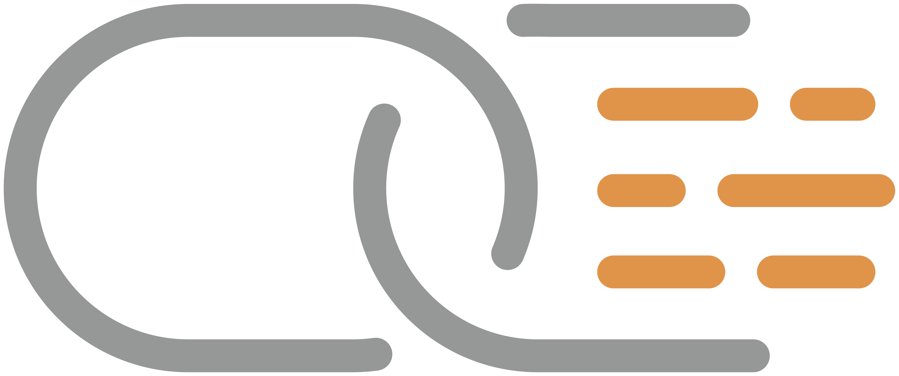
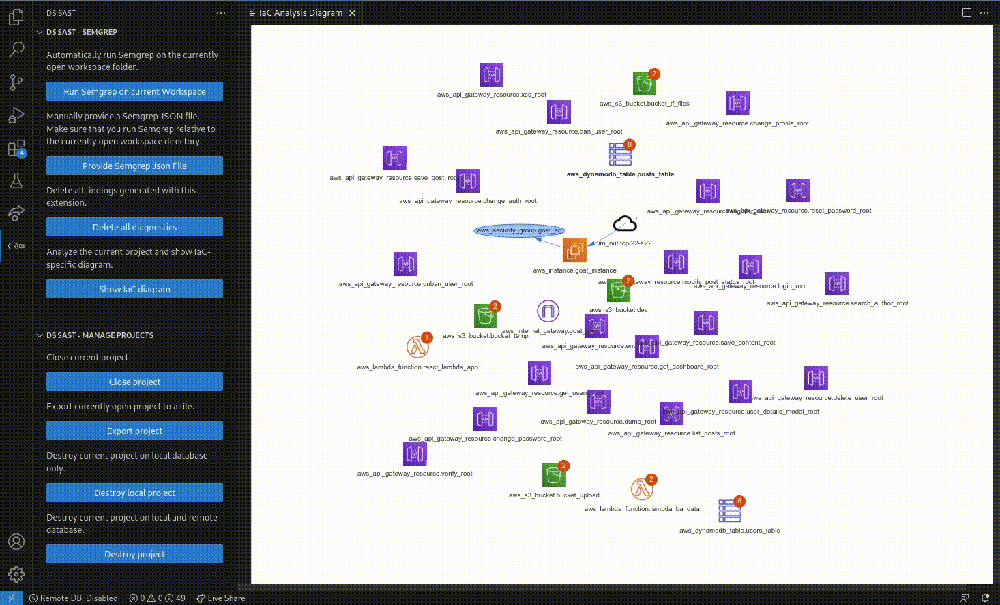
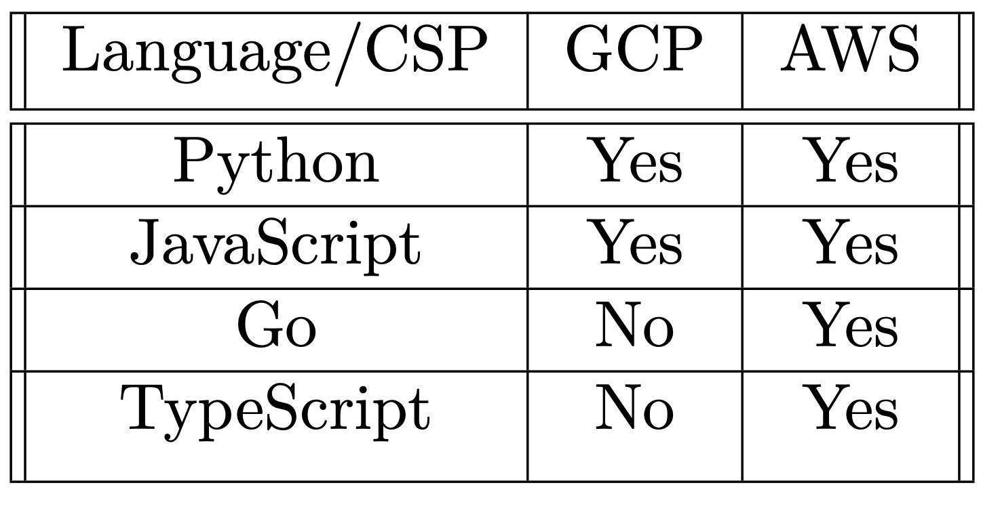
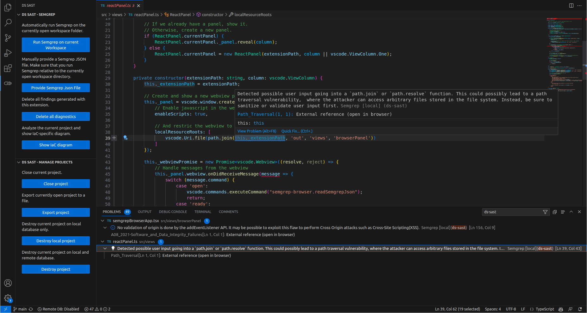

# PoiEx

## What's PoiEx?

**PoiEx** is an experimental VS Code extension built to identify and visualize the Points Of Intersection between a web application and the underlying infrastructure.  

Since it was designed to simplify manual code review activities, it was also packed with: [Semgrep](https://semgrep.dev/) support, notes taking and collaboration capabilities.

 

    

 

Read the launch post on our [Doyensec blog](https://blog.doyensec.com/2024/01/25/poiex-release.html) for practical examples and tips.

## Try it out!

Download and install the VSIX extension from GitHub Releases. Make sure you have [Semgrep](https://semgrep.dev/) installed before running PoiEx.

## Points of Intersection Explorer

A Point of Intersection (PoI) marks where your code interacts with underlying infrastructure, revealing connections between the implemented logic and the Infrastructure as Code (IaC). PoiEx identifies and visualizes PoIs, allowing testers and cloud security specialists to better understand and identify security vulnerabilities in your cloud applications.  
The extension relies on [Inframap](https://github.com/cycloidio/inframap/) to generate an interactive IaC diagram. Each entity in the diagram is clickable to reveal the PoIs, semgrep results and the IaC definition linked to the selected entity. By then clicking on a PoI, the user can jump to the relevant code section. 

Below an example infrastructure diagram generation and PoIs exploration.

**Note**: If you do not have a Terraform IaC definition file but you have access to the live infrastructure, you can use reverse-terraforming tools such as [terraformer](https://github.com/GoogleCloudPlatform/terraformer) to generate an IaC file from existing infrastructure. 

### Core Features

PoiEx allows users to:
  
- Scan the application's code and the IaC definition at the same time with [Semgrep](https://semgrep.dev/), generating explorable results in a user-friendly view inside VS Code's Problems section

- Visualize the infrastructure diagram generated with [Inframap](https://github.com/cycloidio/inframap/). Additionally, the diagram is enhanced to be interactive, each entity in the diagram is clickable and reveals the enumerated PoIs that are linked to the selected entity. By then clicking on a PoI, it jumps to the relevant code section to review the code in which it is embedded. 
  
- Take notes using the VS Code Comments API, allowing it to be used also as a standalone code-analysis tool
  
- Collaborate with other reviewers on encrypted projects pushed to a [MongoDB](https://www.mongodb.com/) instance

### Supported CSPs & Languages

A custom set of semgrep rules has been developed. Each pair of language and Cloud Service Provider (CSP) needs a different ruleset, as a rule is generally able to match only one language and one CSP. 

The table below summarizes the currently supported CSPs and languages
 

    

 

### Enhancing Reviews With PoIEx
Non-IaC related features were added to support manual reviews in different ways. Such functionalities are unrelated to the cloud infrastructure analysis and they are usable in any code review activity. 
Below are attached few examples, please refer to the  [launch blogpost](https://blog.doyensec.com/2024/01/25/poiex-release.html) for detailed use cases.
#### 1. Standalone Semgrep Integration
Scan the application's code and the IaC definition at the same time with [Semgrep](https://semgrep.dev/), generating explorable results in a user-friendly view inside VS Code's Problems section. The semgrep ruleset is fully customizable via direct arguments in the settings page.

It is also possible to flag the findings as `false positive`,`hot` or `resolved` and have them synced in collaboration mode.

#### 2. Notes taking
It is possible to start comment threads directly within the codebase to add details and reactions. 

![[images/threadExample.png]]

When collaboration mode is disabled, each project is stored in a local SQLite database. In this mode, projects are not synchronized or shared across different collaborators.

#### 3. Collaboration With Peers
PoiEx allows for real-time synchronization of findings and comments with other users. This mode requires a MongoDB instance shared across all collaborators.  Read more in the  [collaboration guide](./COLLAB_MODE.md).
## Extension Settings

* `poiex.enableIaC`: Enable IaC features of this extension 
* `poiex.authorName`: Author name for comments
* `poiex.semgrepArgs`: Semgrep command line arguments
* `poiex.semgrepTimeout`: Semgrep execution timeout (in seconds)
* `poiex.collab.enabled`: Enable collaboration via MongoDB
* `poiex.collab.uri`: URI of the remote MongoDB server
* `poiex.collab.database`: Name of the MongoDB database
* `poiex.collab.expireAfter`: Auto-delete comments on the remote database after a certain amount of seconds (set to 0 to disable)

## Credits

This project was made with love in the [Doyensec Research island](https://doyensec.com/research.html) by [Michele Lizzit](https://www.linkedin.com/in/michelelizzit/) for his master thesis at ETH Zurich under the mentoring of [Francesco Lacerenza](https://twitter.com/lacerenza_fra).

Download the last [realease](https://github.com/doyensec/PoiEx/releases) and contribute with a star, [bug reports or suggestions](https://github.com/doyensec/PoiEx/issues).
