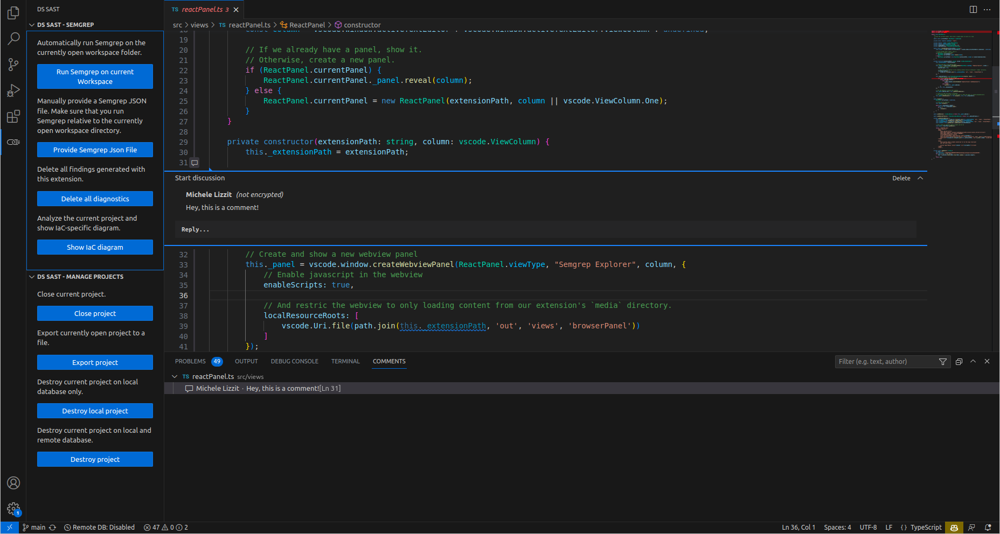

# PoiEx

## What's PoiEx?

**PoiEx** is an experimental VS Code extension built to identify and visualize the Points Of Intersection between a web application and the underlying infrastructure.  

 

    

 

## Try it out!

Download and install the VSIX extension from GitHub Releases. Make sure you have [Semgrep](https://semgrep.dev/) installed before running PoiEx.

## Point of Intersection

A Point of Intersection (PoI) marks where your code interacts with underlying infrastructure, revealing connections between the implemented logic and the Infrastructure as Code (IaC). PoiEx identifies and visualizes PoIs, allowing testers and cloud security specialists to better understand and identify security vulnerabilities in your cloud applications.

## Basic usage

PoiEx allows users to scan the application code and the IaC definition at the same time, generating results in a nice and user friendly view. Users can navigate the infrastructure diagram and quickly jump to the relevant application code sections where the selected infrastructure resource is used. Additionally, PoiEx provides for advanced collaborations capabilities, notes taking using the VS Code Comments API and integration with [Semgrep](https://semgrep.dev/), allowing PoiEx to be used also as a standalone Semgrep extension without any of the IaC-specific features.

### IaC Diagrams and IaC-app linking

PoiEx relies on [Inframap](https://github.com/cycloidio/inframap/) to generate an interactive IaC diagram. Each entity in the diagram is clickable, and reveals PoIs that are linked to the selected entity. By then clicking on a PoI, PoiEx jumps to the relevant code section. If you do not have a Terraform IaC definition file but you have access to the live infrastructure, you can use reverse-terraforming tools such as [terraformer](https://github.com/GoogleCloudPlatform/terraformer) to generate an IaC file from existing infrastructure.

*IaC Diagrams*

### Semgrep integration

*Integration with Semgrep*

### Notes taking

*Collaborative comments*

When collaboration mode is disabled, each project is stored in a local SQLite database. In this mode, projects are not synchronized or shared across different collaborators.

## Collaboration mode
PoiEx allows for real-time synchronization of findings and comments with other users. This mode requires a MongoDB instance shared across all collaborators.  
Collaboration mode is described in [COLLAB_MODE.md](./COLLAB_MODE.md).

## Extension Settings

This extension contributes the following settings:

* `poiex.enableIaC`: Enable IaC features of this extension 
* `poiex.authorName`: Author name for comments.
* `poiex.semgrepArgs`: Semgrep command line arguments.
* `poiex.semgrepTimeout`: Semgrep execution timeout in seconds.
* `poiex.collab.enabled`: Enable collaboration via MongoDB.
* `poiex.collab.uri`: URI of the remote MongoDB server.
* `poiex.collab.database`: Name of the MongoDB database.
* `poiex.collab.expireAfter`: Auto-delete comments on remote database after a certain amount of seconds. (Set to 0 to disable)

## Release Notes

### 1.0.0

First release
