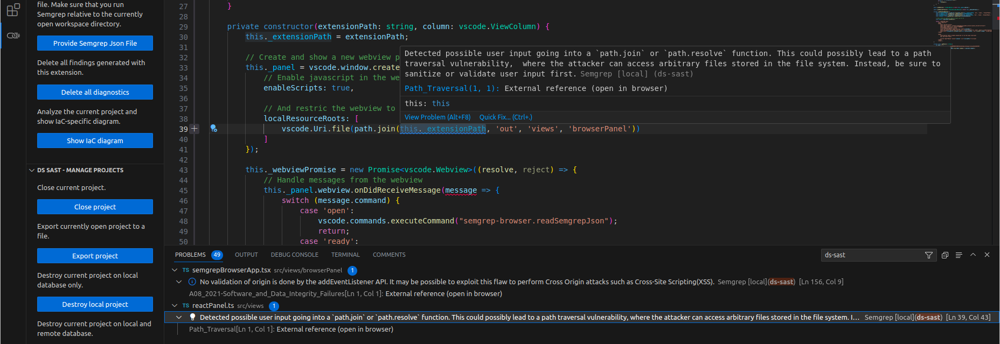
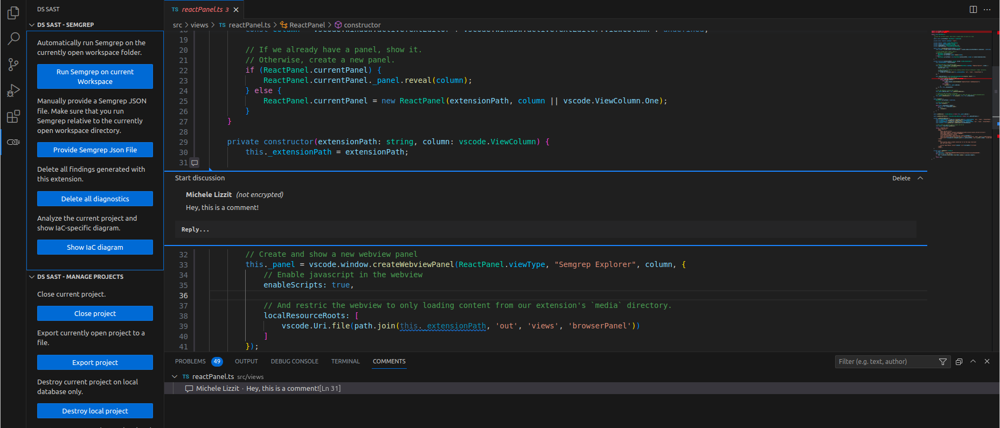

# DS-SAST

## What's DS-SAST?

**DS-SAST** is an experimental VS Code extension built to identify and visualize the Points Of Intersection between a web application and the underlying infrastructure.  

</br>
<p align="center">
    
</p>
</br>

## Try it out!

Download and install the VSIX extension from GitHub Releases. Make sure you have Semgrep installed before running DS-SAST.

## Basic usage

DS-SAST allows users to scan the application code and the IaC definition at the same time, generating results in a nice and user friendly view. Users can navigate the infrastructure diagram and quickly jump to the relevant application code sections where the selected infrastructure resource is used. Additionally, DS-SAST provides for advanced collaborations capabilities, notes taking using the VS Code Comments API and integration with Semgrep, allowing DS-SAST to be used also as a standalone Semgrep extension without any of the IaC-specific features.

### IaC Diagrams

### IaC - App linking

### Semgrep integration


*Integration with Semgrep*

### Notes taking


*Collaborative comments*

## Local database
When collaboration mode is disabled, each project is stored in a local SQLite database. In this mode, projects are not synchronized or shared across different collaborators.

## Collaboration mode
DS-SAST allows for real-time synchronization of findings and comments with other users. This mode requires a MongoDB instance shared across all collaborators.  
Set your name in _Settings > Estensions > DS-SAST > Author Name_ and the database URI. See section below for how to deploy a MongoDB instance.

<h1 align="center">
  <sub>
    
  </sub>
  <sup>
    &nbsp;DS-SAST
  </sup>
</h1>

## Features

* Single-user comments stored on a local SQLite DB
* Multi-user collaborative comments using a shared MongoDB instance
* Store MongoDB credentials using Secrets API
* Enable/Disable remote db connection without reload
* Dynamic comment anchoring using rabin fingerprint and k-mers matching
* Import Semgrep results from external JSON file
* Automatically run Semgrep on currently open workspace
* Specify custom arguments for Semgrep in Vscode settings
* Visualize Semgrep findings as Vscode diagnostics ("Problems" tab)
* Sync Semgrep results across collaborators
* Auto-delete comments on remote MongoDB
* Export current project data to file
* Create and manage multiple projects
* Store and manage project encryption status and key
* Encrypt comments and diagnostics using a shared secret
* Github Actions pipeline to build extension
* Auto-download the correct Inframap binary based on platform
* Visualize Inframap output
* Match Semgrep HCL findings with their respective resource
* Interactive diagram that links PoIs and findings with their respective diagram entity

## TODO:
 * Add support for reactions
 * Add animations to README.md
 * Rename the extension

## Requirements

Semgrep is required to be already installed.

### MongoDB (optional)
DS-SAST supports real-time project synchronization between multiple collaborators.  
To enable collaboration features all collaborators should connect to a common MongoDB instance.
All collaborators should have read and write access to the database configured in the `ds-sast.collab.database` field of VSCode settings. To enable collaboration features set `ds-sast.collab.enabled` to `true` and `ds-sast.collab.uri` to the MongoDB URI. Optionally update `ds-sast.collab.database` if using a database name different from the default value. If credentials are required to connect to the database the extension will prompt the user for credentials.  
The extension supports an auto-delete feature, if `ds-sast.collab.expireAfter` is set to a value higher than 0 it will configure MongoDB to automatically delete projects that are not accessed for the specified number of seconds. The project expiration value is reset each time one of the collaborators accesses the project. The expiration value does not affect project data that is saved locally: if a project is not found on the remote database (because it never existed, or has expired) the extension will push the local version to the remote database.

MongoDB deployment steps on Ubuntu 22.04:

```bash
export ADMIN_USERNAME="username"
export ADMIN_PASSWORD="$(openssl rand -base64 12)"
export FQDN="$(hostname)"
echo "Admin password is: $ADMIN_PASSWORD"

# Install MongoDB from the official repository
curl -fsSL https://pgp.mongodb.com/server-6.0.asc | \
   sudo gpg -o /usr/share/keyrings/mongodb-server-6.0.gpg \
   --dearmor
echo "deb [ arch=amd64,arm64 signed-by=/usr/share/keyrings/mongodb-server-6.0.gpg ] https://repo.mongodb.org/apt/ubuntu jammy/mongodb-org/6.0 multiverse" | sudo tee /etc/apt/sources.list.d/mongodb-org-6.0.list
apt update
apt install -y mongodb-org

# Create a new user and enable authentication
systemctl enable mongod
systemctl start mongod
mongosh <<< "admin = db.getSiblingDB(\"admin\"); admin.createUser({ user: \"$ADMIN_USERNAME\", pwd: \"$ADMIN_PASSWORD\", roles: [ { role: \"root\", db: \"admin\" } ]});"
systemctl stop mongod
echo "security:" >> /etc/mongod.conf
echo '  keyFile: "/etc/mongodb_keyfile"' >> /etc/mongod.conf
echo "  authorization: enabled" >> /etc/mongod.conf
openssl rand -base64 756 > /etc/mongodb_keyfile
chmod 400 /etc/mongodb_keyfile
chown mongodb:mongodb /etc/mongodb_keyfile

# Configure a replica set, we need this as the extension relies on changestreams
echo "replication:" >> /etc/mongod.conf
echo '  replSetName: "rs0"' >> /etc/mongod.conf
sed -i "s/127.0.0.1/0.0.0.0/g" /etc/mongod.conf
systemctl start mongod
mongosh -u "$ADMIN_USERNAME" -p "$ADMIN_PASSWORD" --authenticationDatabase "admin" <<< "rs.initiate()"
mongosh -u "$ADMIN_USERNAME" -p "$ADMIN_PASSWORD" --authenticationDatabase "admin" <<< "var x = rs.conf(); x.members[0].host = \"$FQDN:27017\"; rs.reconfig(x);"
```

After deployment create additional user(s) for the extension collaborators.

## Extension Settings

This extension contributes the following settings:

* `ds-sast.enableIaC`: Enable IaC features of this extension 
* `ds-sast.authorName`: Author name for comments.
* `ds-sast.semgrepArgs`: Semgrep command line arguments.
* `ds-sast.semgrepTimeout`: Semgrep execution timeout in seconds.
* `ds-sast.collab.enabled`: Enable collaboration via MongoDB.
* `ds-sast.collab.uri`: URI of the remote MongoDB server.
* `ds-sast.collab.database`: Name of the MongoDB database.
* `ds-sast.collab.expireAfter`: Auto-delete comments on remote database after a certain amount of seconds. (Set to 0 to disable)

## Release Notes

### 0.0.1

First release
